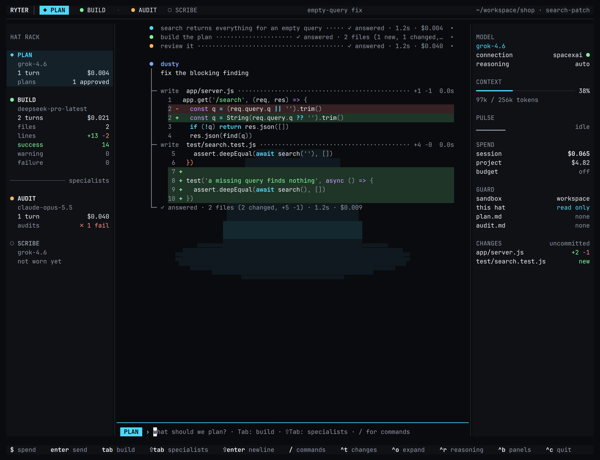

# Ryter

Ryter is Zypher Systems’ terminal AI coding harness.

One model works in your project, with you, and `Tab` switches between its two working hats, **plan** and **build**; `Shift+Tab` reaches the specialists, **audit** and **scribe**. Each hat can run on a model of its own: a strong one to plan, a cheaper one to build, a different one to audit, a small one to write the docs. Bring your own keys: **SpaceXAI** and **OpenRouter** are built in, and local model servers (Ollama, LM Studio, llama.cpp) work without one.


Linux first. The current release is 0.22.0. Apache-2.0.

## Install

```sh
curl -fsSL https://raw.githubusercontent.com/zypher-systems/ryter/main/install.sh | sh
```

This installs a prebuilt binary to `~/.local/bin` for Linux (x86_64 and arm64, static, any distro) or macOS (Apple Silicon and Intel). The download is checked against the release's `SHA256SUMS` first. `RYTER_VERSION=v0.22.0` pins the current release and `RYTER_INSTALL_DIR` picks the folder. Linux gets the full feature set; on macOS everything works except the Landlock sandbox, which is Linux-only.

The installer verifies signed checksums against the same pinned release key as the updater. It requires OpenSSL 3+ with Ed25519 support; set `RYTER_INSTALL_OPENSSL` to its executable if it is not the default `openssl`. Unsigned older releases and invalid signatures are refused before extraction.

Ryter keeps itself up to date. When it starts, at most once a day, it checks for a newer release. If there is one, it installs it, and you restart to use it. `ryter update` does the same on demand, and `ryter update --check` only says whether one is out. An update installs only when its signature matches Ryter's release key and the download matches its checksum. `/settings` → *updates* changes this to *notify* (say it's out, don't install) or *off*. Releases before 0.9.0 don't update themselves: run the install script once more to get 0.9.0.

From source (Rust 1.88+): `cargo install --git https://github.com/zypher-systems/ryter ryter-cli`. A build from source doesn't update itself; update it the way you built it.

## Quick start

```sh
export OPENROUTER_API_KEY=...   # or XAI_API_KEY, or a local model: see below
cd your-project
ryter doctor                    # checks keys, terminal, sandbox; no network
ryter                           # the TUI, in the plan hat ([ui] start_hat picks another)
ryter -p "say hi"               # one headless turn
```

Copy `config.example.toml` to `~/.ryter/config.toml`. If you put `api_key` in that file, `chmod 600` it.

Your standing rules for every project go in `~/.ryter/RYTER.md`, and a project's own go in `RYTER.md` at its top. Ryter gives both to the model on every message. Tell it "from now on…" or type `/rules`, and it offers to save the rule: you see the change and say yes before anything is written.

Full usage: [docs/guide.md](docs/guide.md).

## How it works

One model works in your files. `Tab` cycles its hat, and the message box shows the hat in its own color:

| Hat | Does |
| --- | --- |
| **plan** | reads and proposes; shows you a plan to approve, adjust or reject; changes nothing |
| **build** | changes your files; your toolchains and the project's containers run, and edits, deletions and publishing ask first |
| **scribe** | writes the documentation and nothing else: `.md`, `.txt` and their kind; give it a cheap model |
| **audit** | runs everything the project has against the plan you approved, the product included, and files its findings on a card you can hand to the builder; a checkpoint puts back anything it changed |



- **A plan is approved in its own panel.** `y` saves it as `.ryter/plan.md` (and a dated copy under `.ryter/plans/`) and the build starts from that file; that is the one hat change Ryter makes on its own. Where the work later differs from it, the difference and the reason are recorded in `.ryter/decisions.md`, which an audit reads.
- **Each hat can have its own model** (`/models`). The hats share one conversation, and Ryter says what it costs when a different model takes over.
- **`/audit` asks for an audit**, with its cost up front. It ends on a card: the verdict and the findings, written to `.ryter/audit.md`; `y` hands it to the build hat to repair.
- **Before each build turn Ryter checkpoints your files**, and `/undo` puts them back. `/changes` shows what changed, file by file with diffs, and can undo a single file.
- **`/commit`** drafts the message from the diff and from what the model said about why, and commits the files you choose. Its receipt trailer records the model, the cost, the test result and the review (`Ryter: deepseek-pro-latest · $0.34 · tests ✓ 13 passed · review ✓ grok-4.7`).
- **Every call is priced** as it happens, for the session and for the project. A model with no known price shows `$?.??`, never a fake `$0.00`. `/budget 5` caps the session, `/budget +2` raises it, and `/budget off` lifts the cap.
- **Web search** is a row under the connections in `/provider`: Tavily, your own SearXNG server, or off. The choice is saved, and the session you are in starts using it at once.

Nothing is committed unless you commit it.

## CLI

```
ryter                         TUI
ryter -p TEXT [--json]        one headless turn
ryter -c -p TEXT              continue the latest session headless
ryter --hat build|plan|audit|scribe -p TEXT    (default build)
ryter --hat build             the TUI in that hat, for this run
ryter --connection spacexai|openrouter
ryter --sandbox off|workspace|read-only
ryter spend [session]
ryter spend --project         this repository, across sessions
ryter connections [add|remove|test|set-key]   (bare: list)
ryter models [connection]
ryter sessions
ryter resume [id]
ryter mcp serve               inbound MCP on stdio
ryter serve --socket /tmp/ryter.sock  inbound MCP on a unix socket
ryter serve --bind HOST:PORT --token …
ryter doctor
ryter update [--check]        install a newer signed release, or only say if one is out
ryter trust                   trust this dir’s .ryter/
ryter --version               no config, keyring, or network
```

Budget exceeded exits `3`. Unknown model prices display as `$?.??`, never a fake `$0.00`.

## License

Apache-2.0. See `LICENSE`.
